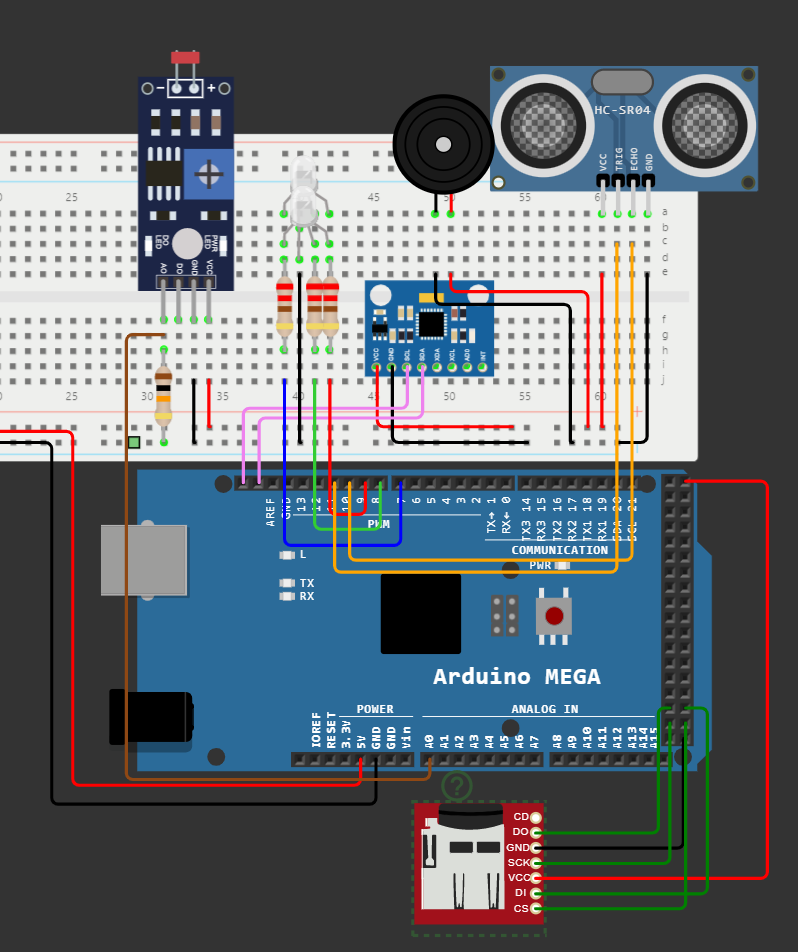

# EDL Control System

This project is a simulation of a Mars Landing that gathers data from various sensors and processes it to determine the current stage of a Mars Rover mission. The system continuously logs and analyzes data related to light levels, distances, temperatures, and accelerations in three axes (X, Y, Z). This data is then used to determine the current mission stage and visualize the data using Python for further analysis.

## Installation

1. Clone this repository
2. Open `UP958669/UP958669.ino` in the Arduino IDE
3. Install the necessary libraries:
   - MPU6050_tockn
   - NewPing
   - SD
4. Connect the hardware components according to the schematic diagram
5. Upload the code to the Arduino MEGA2560
6. Monitor the output on the serial monitor and the SD card

## Arduino Connections

## Usage

1. Make sure the Arduino code has been uploaded to the Arduino board and is running to collect and log the sensor data.
2. Transfer the data.txt file from the SD card to your computer.
3. Run the Python script by executing `python data_analysis.py` (replace `data_analysis.py` with the actual name of your Python script).
4. Check the generated visualizations in the output folder as PNG files.

## Arduino Code

The Arduino code is responsible for collecting sensor data, controlling LEDs and a buzzer, and logging the data to an SD card. The sensors used in the project include:

- MPU6050: A 6-axis accelerometer and gyroscope module used to measure accelerations and temperatures.
- HC-SR04: An ultrasonic distance sensor to measure distance.
- Photoresistor: A light-dependent resistor used to measure light levels.

The LED lights and buzzer provide visual and auditory feedback on the current mission stage. The data collected by the sensors is logged to an SD card with timestamps and mission stage information for further analysis.

## Python Code

The Python code reads the sensor data logged by the Arduino and processes it to generate graphs and visualizations. The code utilizes popular Python libraries such as NumPy, pandas, and Matplotlib to perform data analysis and create visual representations of the data. The following visualizations are generated:

- Line plots of light levels, distances, temperatures, and accelerations over time.
- Bar charts showing the counts of completed and next stages.
- A correlation matrix of the sensor data.

These visualizations are saved as PNG files for easy sharing and analysis.

## Mission Stages

The Mars Rover telemetry system simulates the following mission stages based on distance thresholds:

1. Parachute Deployment
2. Heat Shield Separation
3. Radar Lock
4. Terrain Relative Navigation
5. Backshell Separation
6. Rover Separation

As the Rover progresses through these stages, the Arduino code updates the LED lights' colors and activates
